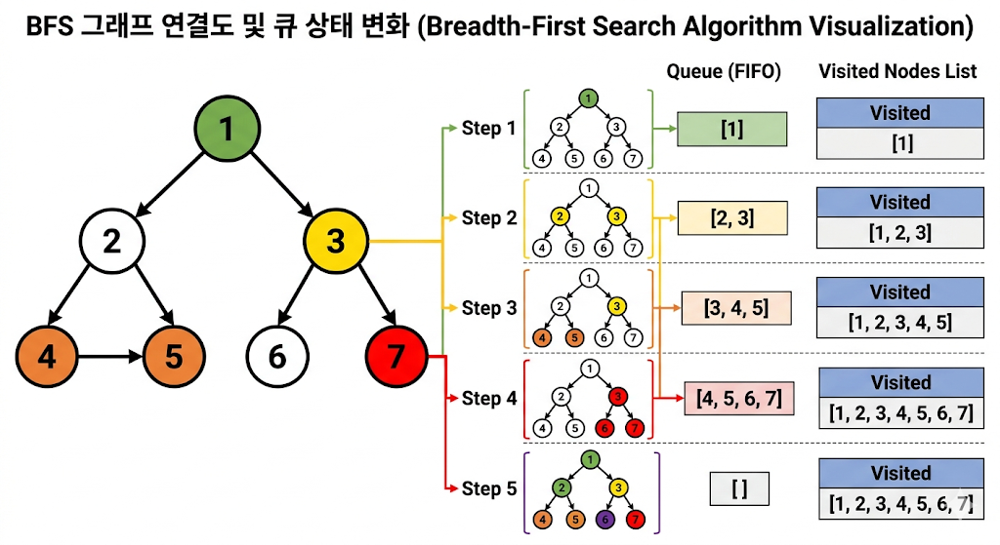

# 그래프 탐색

## 너비 우선 탐색 (BFS, Breadth-First Search)

BFS는 시작 노드에서부터 **거리가 가까운 노드들을 우선적으로 탐색**하는 방식입니다. 쉽게 말해 "옆으로 넓게" 퍼져나가며 탐색하는 방법입니다.


### 💡 동작 원리: "선입선출(FIFO) 큐(Queue) 활용"

BFS는 **큐(Queue)**라는 자료구조를 사용하여 다음에 방문할 노드들을 순서대로 저장합니다.

1. **시작 노드 방문**: 시작 노드를 방문 처리하고 큐에 넣습니다.
2. **큐에서 꺼내기**: 큐에서 노드를 하나 꺼냅니다.
3. **인접 노드 확인**: 꺼낸 노드와 연결된 노드들 중 아직 방문하지 않은 노드들을 **모두** 큐에 넣고 방문 처리합니다.
4. **반복**: 큐가 빌 때까지 2번과 3번 과정을 반복합니다.

---

### 🏃‍♂️ 탐색 예시 (흐름 이해하기)

# 🔍 너비 우선 탐색 (BFS, Breadth-First Search) 이해하기

## 🗺️ 시작 그래프 상황
우리는 **1번 노드**에서 출발해서 모든 노드를 너비 우선 탐색(BFS)으로 방문합니다.

* **연결 관계**: `1` -> `2, 3` / `2` -> `4, 5` / `3` -> `6, 7`
* **탐색 목표**: 시작점에서 가장 가까운 노드(층별)부터 차례대로 방문하기!

---

## 🚀 단계별 탐색 과정


### 🔴 Step 1: 시작 노드 방문 및 큐(Queue) 삽입
제일 먼저 시작점인 `1`을 방문하고, "다음에 방문할 인접 노드를 찾을 후보"로 **큐**(Queue)에 넣습니다.
* **방문 완료**: `[1]`
* **큐 상태**: `[1]` (맨 앞)
* **설명**: 1번 노드를 큐에 넣고 방문 처리합니다.

### 🔴 Step 2: 큐에서 1 꺼내기 & 인접 노드(2, 3) 탐색
큐의 맨 앞에 있던 `1`을 꺼냅니다. 그리고 `1`과 연결된 아직 방문하지 않은 노드들을 모두 큐에 넣고 방문 처리합니다.
* **방문 완료**: `[1, 2, 3]`
* **큐 상태**: `[2, 3]`
* **설명**: `1`을 꺼내고, `1`의 인접 노드인 `2`와 `3`을 큐에 넣습니다. **이게 핵심! 옆으로 퍼지는 단계입니다.**

### 🔴 Step 3: 큐에서 2 꺼내기 & 인접 노드(4, 5) 탐색
이제 큐의 맨 앞인 `2`를 꺼냅니다. `2`와 연결된 안 가본 노드(`4, 5`)들을 큐에 넣고 방문 처리합니다.
* **방문 완료**: `[1, 2, 3, 4, 5]`
* **큐 상태**: `[3, 4, 5]`
* **설명**: `2`를 꺼내고, 그 자식들인 `4`와 `5`를 큐 뒤에 붙입니다. 아직 `3`은 큐 안에서 자기 차례를 기다리고 있습니다.

### 🔴 Step 4: 큐에서 3 꺼내기 & 인접 노드(6, 7) 탐색
큐 맨 앞의 `3`을 꺼냅니다. `3`과 연결된 안 가본 노드(`6, 7`)들을 큐에 넣고 방문 처리합니다.
* **방문 완료**: `[1, 2, 3, 4, 5, 6, 7]`
* **큐 상태**: `[4, 5, 6, 7]`
* **설명**: `3`을 꺼내고, 그 자식들인 `6`과 `7`을 큐 뒤에 붙입니다. 이제 모든 노드가 방문 처리되었습니다.

### ⚪ Step 5: 남은 노드(4, 5, 6, 7) 차례로 꺼내기
큐에는 더 이상 방문할 자식이 없는 노드들만 남았습니다. 순서대로 꺼내며 종료합니다.
1.  `4` 꺼내기 → 인접 노드 없음 → 큐: `[5, 6, 7]`
2.  `5` 꺼내기 → 인접 노드 없음 → 큐: `[6, 7]`
3.  `6` 꺼내기 → 인접 노드 없음 → 큐: `[7]`
4.  `7` 꺼내기 → 인접 노드 없음 → 큐: `[]` **(비었음!)**

---

## 🏁 최종 탐색 결과
큐가 완전히 비었으므로 BFS가 종료됩니다.

**방문 순서**:  
$$1 \rightarrow 2 \rightarrow 3 \rightarrow 4 \rightarrow 5 \rightarrow 6 \rightarrow 7$$

> **💡 핵심 요약**:  
> 가장 가까운 **층(Layer)**부터 훑고 내려가는 방식입니다. 큐를 사용하여 **선입선출(FIFO)** 원칙에 따라 먼저 발견된 노드를 먼저 처리하기 때문에 가능한 로직입니다.


---

### 🛠️ C++ 핵심 코드 (STL Queue 활용)

```cpp
#include <iostream>
#include <vector>
#include <queue>

using namespace std;

void bfs(int start, vector<int> adj[], bool visited[]) {
    queue<int> q;

    // 1. 시작 노드를 큐에 넣고 방문 처리
    q.push(start);
    visited[start] = true;

    while (!q.empty()) {
        // 2. 큐에서 노드를 하나 꺼냄
        int x = q.front();
        q.pop();
        cout << x << " "; // 방문 노드 출력

        // 3. 해당 노드와 연결된 인접 노드들을 확인
        for (int i = 0; i < adj[x].size(); i++) {
            int y = adj[x][i];
            // 방문하지 않은 노드라면 큐에 넣고 방문 처리
            if (!visited[y]) {
                q.push(y);
                visited[y] = true;
            }
        }
    }
}